# Room Service Proxy Architecture

## Overview

The Room Service Proxy is a multi-tenant SaaS wrapper that provides isolation, routing, and management for multiple RoomService instances. Each tenant gets their own isolated RoomService deployment while sharing the proxy infrastructure.

## High-Level Architecture

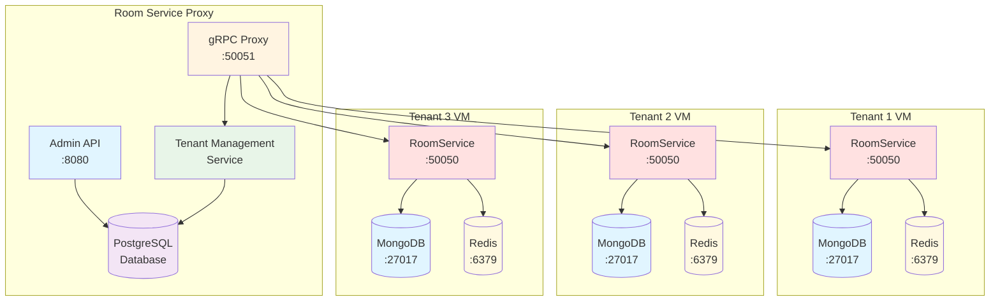

## Request Flow

### 1. Tenant Creation Flow

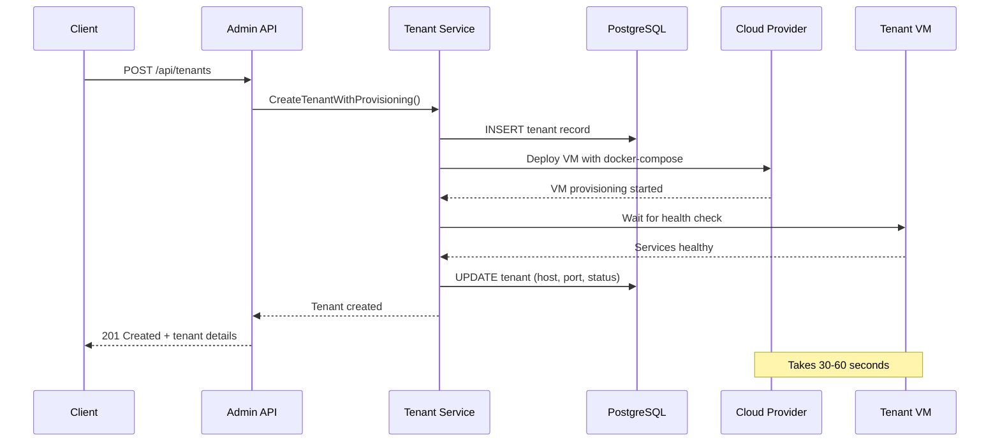

### 2. gRPC Request Flow (Runtime)

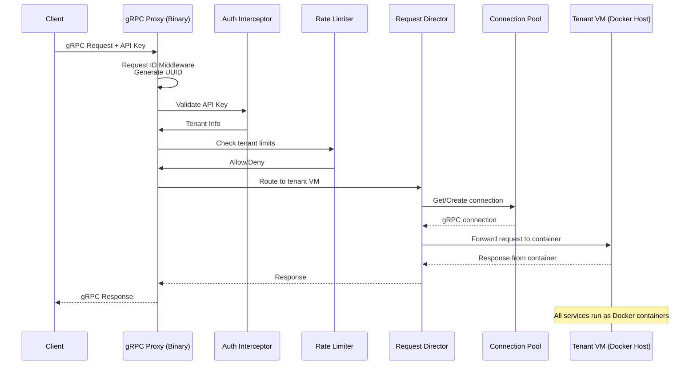

## Authentication & Routing Flow

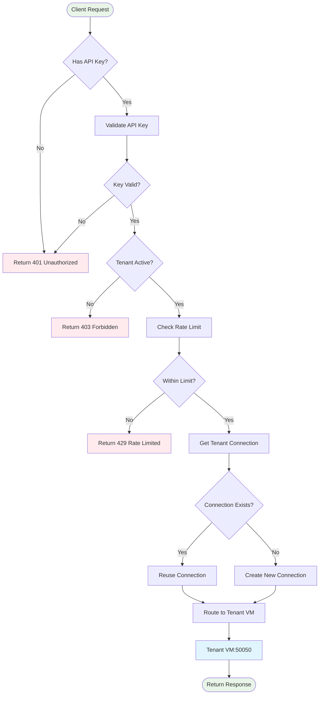

## Connection Pool Management

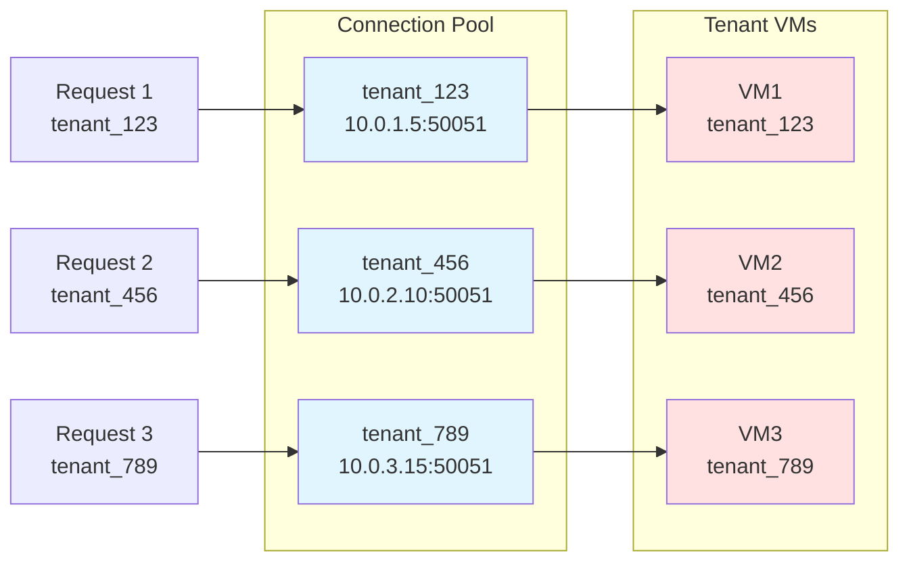

## Tenant VM Architecture

Each tenant VM runs **all services as Docker containers** via docker-compose:

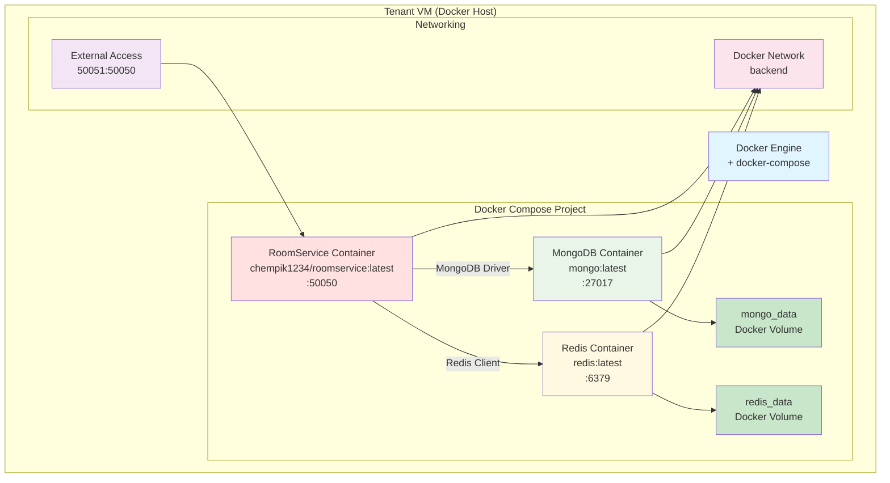

## Deployment Adapter Pattern

The proxy uses a **deployment adapter pattern** to support multiple cloud providers through a unified interface:

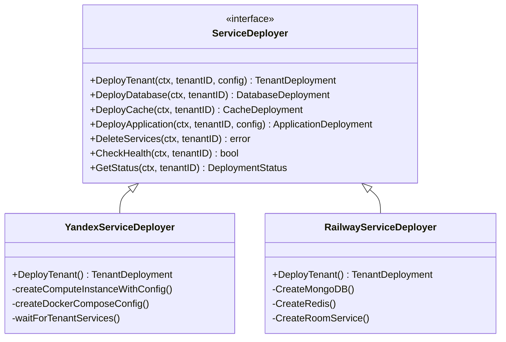

### Benefits of Adapter Pattern
- **Cloud Agnostic**: Easy to add new providers (AWS, GCP, Azure)
- **Unified API**: Single interface for all deployment operations
- **Provider Optimization**: Each adapter uses provider-specific best practices
- **Testing**: Mock adapters for development/testing
- **Migration**: Easy tenant migration between providers

## Deployment Providers Comparison

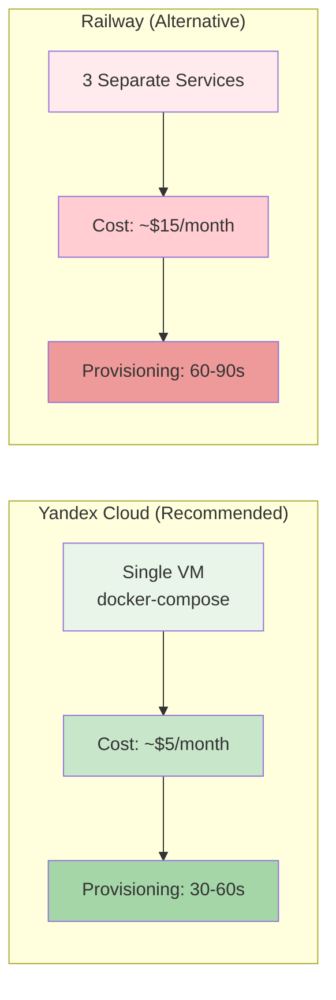

## Request Tracing Example

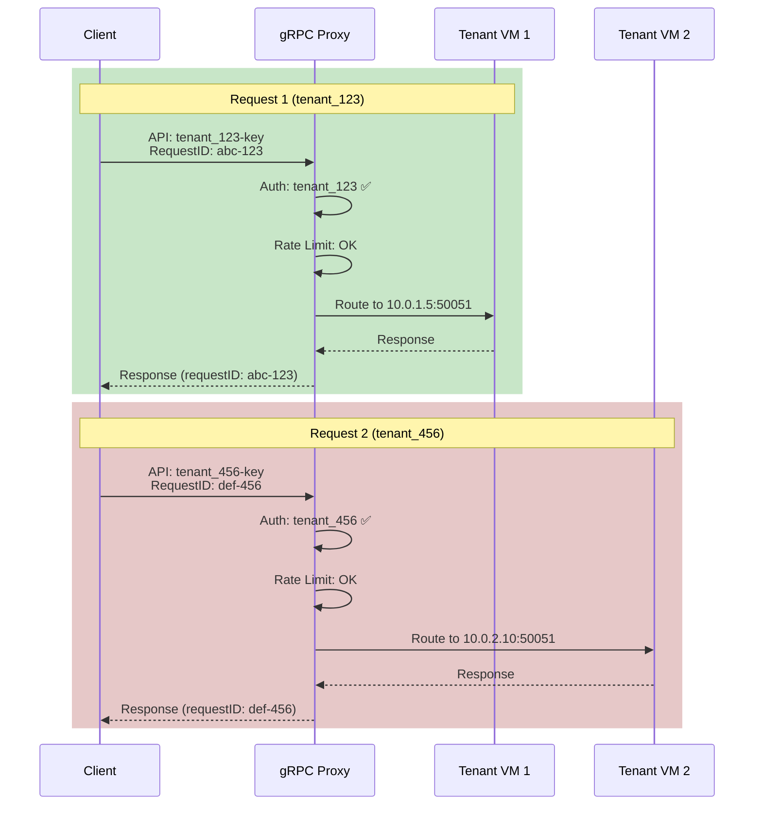

## Monitoring & Logging

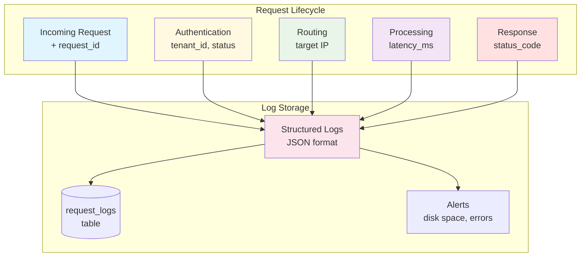

## Security Architecture

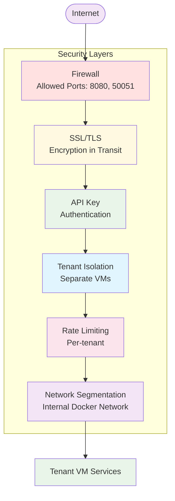

## Cost Comparison

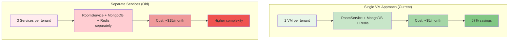

## Horizontal Scaling

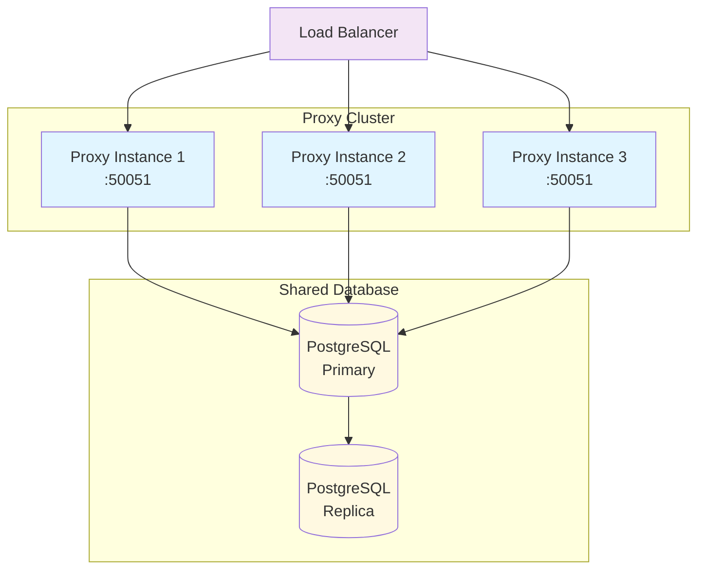

## Key Features Summary

| Feature | Description |
|---------|-------------|
| **Multi-tenancy** | Each tenant gets isolated VM with docker-compose |
| **Containerized Services** | RoomService, MongoDB, Redis all run as containers |
| **gRPC Proxying** | Intelligent routing based on API keys |
| **Connection Pooling** | Reuse connections for better performance |
| **Request Tracing** | Unique request ID for end-to-end tracking |
| **Authentication** | API key validation per tenant |
| **Rate Limiting** | Per-tenant request limits |
| **Auto-provisioning** | Automated VM deployment with docker-compose |
| **Health Monitoring** | Continuous health checks for all containers |
| **Cost Optimization** | 67% savings with single VM approach |
| **Logging** | Comprehensive request logging with tenant context |

## Future Enhancements

1. **Auto-scaling**: Automatically add proxy instances under load
2. **Geo-distribution**: Deploy proxies in multiple regions  
3. **Advanced monitoring**: Prometheus, Grafana integration
4. **Backup automation**: Automated tenant VM backups
5. **Migration tools**: Easy tenant export/import
6. **API versioning**: Support multiple RoomService versions
7. **Webhook notifications**: Tenant status changes, alerts
8. **Custom domains**: Tenant-specific subdomains
